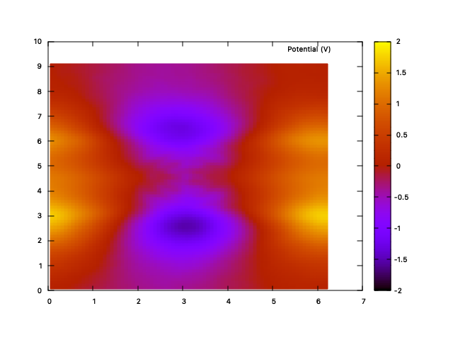

# potential.py



A Python reimplementation of GROMACS `gmx potential` using MDAnalysis. Calculates the electrostatic potential along a simulation box axis by dividing the system into slices, computing the charge density, and solving the Poisson equation.

By default, uses **Fourier-space integration**, which naturally respects periodic boundary conditions and eliminates the slice-count-dependent artifacts that plague the classical real-space double integration used by `gmx potential`.

Based on the methodology described in:
> Gurtovenko & Vattulainen, *J. Chem. Phys.* **130**, 215107 (2009) — [doi:10.1063/1.3148885](https://doi.org/10.1063/1.3148885)

## Requirements

- Python 3.8+
- NumPy
- MDAnalysis (`pip install MDAnalysis`)

Install dependencies:

```bash
pip install numpy MDAnalysis
```

## Quick start

```bash
python potential.py -s topol.tpr -f traj.xtc -center
```

This reads charges from `topol.tpr`, processes every frame of `traj.xtc`, slices the box along the Z axis, and writes three output files:

| File | Contents | Units |
|------|----------|-------|
| `potential.xvg` | Electrostatic potential | V |
| `charge.xvg` | Charge density | e/nm^3 |
| `field.xvg` | Electric field | V/nm |

## Command-line options

### Input / output

| Flag | Default | Description |
|------|---------|-------------|
| `-s` | *(required)* | GROMACS `.tpr` file (provides atomic charges) |
| `-f` | *(required)* | Trajectory file (`.xtc`, `.trr`, `.gro`, `.pdb`, ...) |
| `-o` | `potential.xvg` | Output electrostatic potential (reaction potential from charges) |
| `-oc` | `charge.xvg` | Output charge density |
| `-of` | `field.xvg` | Output electric field |
| `-ot` | `potential_total.xvg` | Output total potential including applied field ramp (requires `-efield`) |

### Analysis

| Flag | Default | Description |
|------|---------|-------------|
| `-d` | `Z` | Axis to slice along (`X`, `Y`, or `Z`) |
| `-sl` | auto | Number of slices (see [Choosing the number of slices](#choosing-the-number-of-slices)) |
| `-b` | -- | First frame time to read (ps) |
| `-e` | -- | Last frame time to read (ps) |
| `-dt` | -- | Only use frames at multiples of this interval (ps) |

### Centering and symmetrization

| Flag | Description |
|------|-------------|
| `-center` | Center coordinates each frame w.r.t. center of mass of the centering group. Eliminates artifacts from bilayer drift along the box axis. |
| `-symm` | Symmetrize profiles around the box center. Implies `-center`. Useful for symmetric bilayers to improve statistics. |
| `-group` | MDAnalysis atom selection string for atoms to include in the calculation (default: `"all"`). |
| `-center-group` | MDAnalysis atom selection string for the centering group (default: same as `-group`). |

### Integration method

| Flag | Description |
|------|-------------|
| `-classical` | Use classical real-space double integration instead of Fourier. Reproduces `gmx potential` behavior, including its artifacts. |
| `-sachs` | With `-classical`: apply the Sachs et al. correction, enforcing equal potential on both sides of the box. Has no effect without `-classical` (Fourier is inherently periodic). |
| `-correct` | With `-classical`: apply the `gmx potential` `-correct` procedure (subtract mean charge density and mean electric field). Removes linear drift. Has no effect without `-classical`. |

### 2D potential maps

| Flag | Default | Description |
|------|---------|-------------|
| `-2Dmap` | -- | Compute a 2D potential map on the given plane. Takes a two-letter plane specification: `XZ`, `XY`, or `YZ`. Charges are averaged over the third axis and the 2D Poisson equation is solved in Fourier space. Output: `potential_2d.dat` and `charge_2d.dat`. |
| `-2Defield` | -- | Applied electric field for 2D maps: three components `Ex Ey Ez` in V/nm (from GROMACS `electric-field-x/y/z` mdp parameters). The in-plane field components are added as a linear ramp to produce the total potential (`potential_total_2d.dat`). Requires `-2Dmap`. |

When `-2Dmap` is used, the tool switches to 2D mode. The `-sl` flag sets the number of bins per axis (same for both). If not specified, the grid size is auto-estimated (more conservatively than 1D, typically 20-500 bins per axis, since each bin receives fewer atoms). The `-center` flag centers along both in-plane axes. The output uses a gnuplot-compatible 3-column format (axis1, axis2, value) with blank lines between rows.

When `-2Defield Ex Ey Ez` is provided, the tool computes the total potential by adding the linear ramp from the in-plane field components: Phi_total(x1, x2) = Phi_reaction(x1, x2) - E1 * x1 - E2 * x2, where E1 and E2 are the field components along the two in-plane axes. The field component along the averaging axis does not appear in the 2D map (the tool prints a note if it is nonzero). The applied voltages along each in-plane axis are reported as V = E * L.

The 1D-specific flags (`-classical`, `-sachs`, `-correct`, `-symm`, `-efield`, `-o`, `-oc`, `-of`, `-ot`) have no effect in 2D mode — the 2D solver always uses Fourier integration.

### Applied electric field

| Flag | Default | Description |
|------|---------|-------------|
| `-efield` | -- | Applied external electric field in V/nm (from GROMACS `electric-field-z` mdp parameter). Computes total potential (reaction + linear ramp), automatically detects bulk water regions, and reports the applied voltage V = E * L_z along with a slope-based voltage estimate. |

### Output format

| Flag | Default | Description |
|------|---------|-------------|
| `-xvg` | `xmgrace` | XVG format: `xmgrace`, `xmgr`, or `none` (plain columns) |

## Usage examples

### Basic usage (Fourier, recommended)

```bash
python potential.py -s topol.tpr -f traj.xtc -center
```

### Classical integration (gmx potential behavior)

```bash
python potential.py -s topol.tpr -f traj.xtc -center -classical
```

### Classical with -correct (drift removal)

```bash
python potential.py -s topol.tpr -f traj.xtc -center -classical -correct
```

### Classical with Sachs correction (symmetric systems)

```bash
python potential.py -s topol.tpr -f traj.xtc -center -classical -sachs
```

### Lipid bilayer with centering and symmetrization

```bash
python potential.py -s topol.tpr -f traj.xtc -center -symm \
    -center-group "resname POPC POPE"
```

### Compute potential for lipids only (excluding solvent)

```bash
python potential.py -s topol.tpr -f traj.xtc -group "not resname SOL NA CL" \
    -center -center-group "resname POPC"
```

### 2D potential map on the XZ plane

```bash
python potential.py -s topol.tpr -f traj.xtc -center -2Dmap XZ
```

This bins charges into a 2D grid on the XZ plane (averaging over Y), solves the 2D Poisson equation in Fourier space, and writes `potential_2d.dat` and `charge_2d.dat`. The output is in gnuplot `splot` format (3 columns: X, Z, value). To visualize with gnuplot:

```gnuplot
set pm3d map
splot 'potential_2d.dat' using 1:2:3 with pm3d title "Potential (V)"
```

### 2D map with custom resolution

```bash
python potential.py -s topol.tpr -f traj.xtc -center -2Dmap XZ -sl 100
```

Uses 100 x 100 bins. Coarser grids converge faster (fewer frames needed); finer grids require longer trajectories.

### 2D map with applied electric field

```bash
python potential.py -s topol.tpr -f traj.xtc -center -2Dmap XZ \
    -2Defield 0 0 E_z
```

Computes the 2D reaction potential on the XZ plane and adds the linear ramp from the applied field (E_z) to produce the total potential in `potential_total_2d.dat`. The total potential shows the non-periodic voltage drop across the membrane, resolved laterally — useful for visualizing how the potential landscape differs inside a channel pore vs the surrounding lipid.

### Simulation with applied electric field

```bash
python potential.py -s topol.tpr -f traj.xtc -center -efield E_z
```

This computes the reaction potential from charges (periodic), adds the linear ramp from the applied field to produce the total potential (`potential_total.xvg`), detects bulk water regions, and reports the applied voltage and slope-based estimate.

### Plain output without xmgrace headers

```bash
python potential.py -s topol.tpr -f traj.xtc -xvg none -center
```

## Choosing the number of slices

If `-sl` is not specified, the tool auto-estimates a value based on the box length and number of atoms (typically 50-1000 slices). Guidelines:

- **Too few slices** (e.g., 10-30): Poor spatial resolution, smooths out real features.
- **Too many slices** (e.g., >1000): Each slice contains very few atoms per frame, leading to noisy charge density.
- **Good range**: 200-500 slices for a typical ~10 nm box (slice width ~0.02-0.05 nm). More frames help compensate for finer slicing.

With the **Fourier method** (default), the result is stable across slice counts. With `-classical`, the result can vary dramatically with the number of slices, see a full discussion [here](https://www.kopec-lab.com/blog/2026/membrane-potential-gmx/)

---


